# Projeto FiapRide - [Gabriel Hiro Nakamura]

## Informações do Aluno
- **Nome:** [Gabriel Hiro Nakamura]
- **RM:** [562221]
- **Turma:** [2CCPG]
- **Curso:** [Ciência da Computação]
- **GitHub:** [@Gabriel-H182007]
  
---

## Descrição do Projeto

Este projeto é o resultado do aprendizado nas aulas 1-9 de 
Programação Orientada a Objetos, onde desenvolvemos o sistema
**FiapRide** (aplicativo de mobilidade urbana).

---

## Checklist de Implementação

- [x] Aula 1 - Classes e Objetos
- [x] Aula 2 - Métodos
- [x] Aula 3 - Encapsulamento
- [x] Aula 4 - Construtores
- [x] Aula 5 - Associação
- [x] Aula 6 - Herança
- [x] Aula 7 - Polimorfismo
- [x] Aula 8 - Classes Abstratas
- [x] Aula 9 - Interfaces

---

## Perguntas de Reflexão

### Aula 1 - Classes e Objetos
**Pergunta:** "**Pergunta:** Por que precisamos criar
uma classe `Passageiro`? Não seria mais fácil apenas 
criar variáveis soltas no main, como `String nomeAna 
= "Ana"` e `double saldoAna = 50.0`?

**Pense:** E se o FiapRide tiver 1 milhão de usuários?
Como a Classe ajuda a resolver isso?"

**Sua Resposta:**

[Precisamos criar uma classe `Passageiro` porque criar 
variáveis soltas no main dificultaria a organização do 
sistema e ficaria confuso e difícil de fazer a manutenção 
do código principalmente com o passar do tempo e se o 
sistema tiver muitos usuários. Além disso, a classe Passageiro, 
permite reutilizar a mesma estrutura para inúmeros usuários,
permitindo assim instanciar vários objetos com os mesmos 
atributos, mas com valores diferentes,o que facilita a 
escalabilidade e leitura do código por outros desenvolvedores, 
bem como isso segue as boas práticas de programação orientada a objetos.]

**Prints dos diagramas:**
| FiapRide | Smartwatch |
|----------|----------|
| 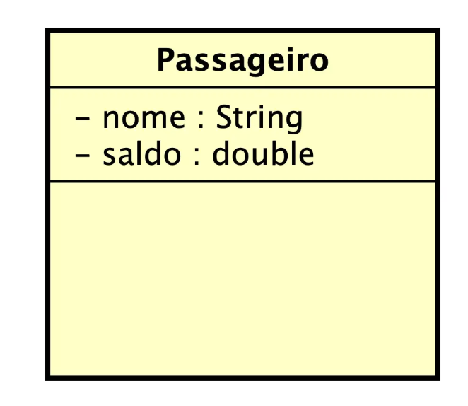 | 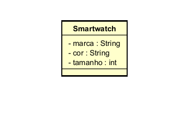 |

 ---

### Aula 2 - Métodos

**Pergunta:** "Se nós podemos simplesmente fazer `passageiro.saldo = 
passageiro.saldo \+ 100` diretamente no código principal, porque dá 
tanto trabalho criar um método específico chamado `adicionarSaldo\(valor\)` 
para fazer isso? Quais seriam os riscos para a nossa startup de mobilidade
se deixássemos qualquer programador alterar o saldo diretamente?"

**Sua Resposta:**

[A criação de um método como adicionarSaldo(valor) permite controlar melhor como 
o saldo é alterado no sistema, pois um dos riscos para a startup de mobilidade é
que qualquer programador poderia inserir valores inválidos, como negativos ou burlar
o sistema com manipulações indevidas dos dados, o que prejudicaria e poderia causar 
prejuízos a empresa. Além disso, isso dá bastante trabalho pelo fato de ter que alterar
diretamente o saldo, exigindo assim mais linhas de códigos, porém isso gera vantagens com
relação a segurança e organização a longo prazo através das validações que são feitas.]

**Prints dos diagramas:**
| FiapRide | Smartwatch |
|----------|----------|
| 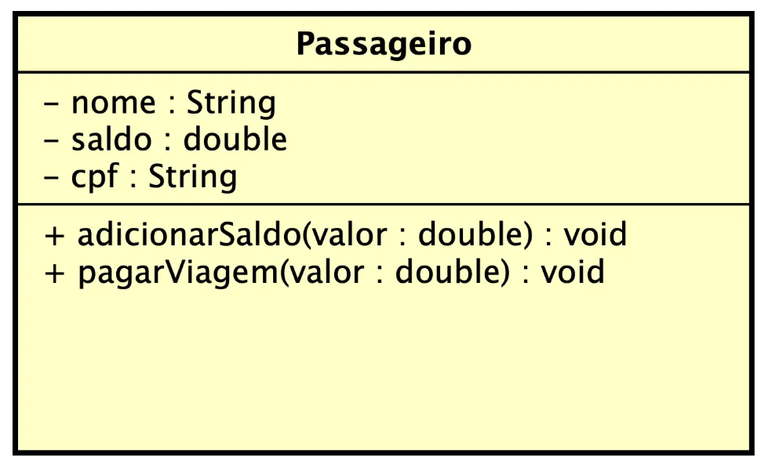 | 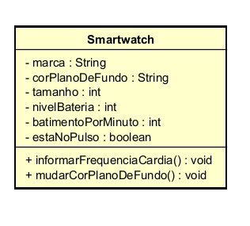 |

---

### Aula 3 - Encapsulamento

**Pergunta:** "No nosso código, os atributos são `private`, mas os métodos
`getSaldo\(\)` e `getNome\(\)` são `public`. Por que é seguro deixar o `get`
público, mas perigoso deixar o atributo original público?

Pense bem: Qual a diferença entre dar a alguém uma CÓPIA de um documento seu,
e entregar o documento ORIGINAL para a pessoa rasurar? "

**Sua Resposta:**

[Deixar os métodos `getSaldo` e `getNome`como público é seguro pelo fato de eles
apenas conseguirem acessar o valor do atributo de forma controlada, sem modificar ele
diretamente. Por outro lado, é perigoso deixar o atributo original como público, pois 
qualquer parte do código poderia modificar o valor sem nenhum tipo de validação para 
impedir,o que poderia gerar erros e inconsistências. Com isso, o uso do encapsulamento 
permite uma melhor proteção, organização dos dados e garante que as mudanças só aconteçam
por meio de métodos específicos, como setters ou métodos com regras de negócio, já que o get
funciona como uma cópia em que só é possível visualizar a informação.]

**Prints dos diagramas:**
| FiapRide | Smartwatch |
|----------|----------|
| 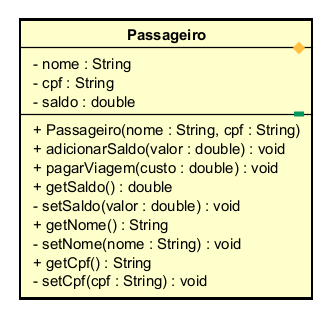 | 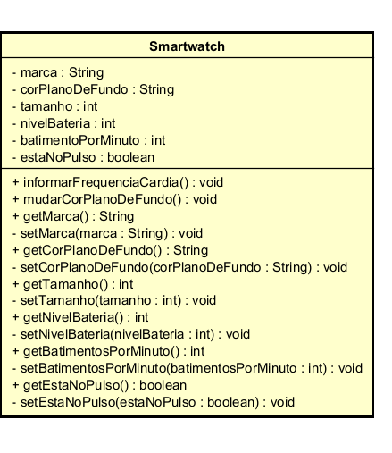 |

---

## Aula 4 - Construtores

**Pergunta:** "> "Na nossa classe `Veiculo`, nós tomamos duas decisões arquitetônicas
muito importantes:

>
> 1. Nós **não** criamos o método `setModelo\(\)`.
> 2. O `setPlaca\(\)` foi criado como **privado**, e criamos um método público chamado `
  atualizarPlaca\(\)` para acessá-lo.

>
> Pensando no mundo real e no Clean Code: Por que é um erro gravíssimo clicar em 'Gerar
Getters e Setters para tudo' automaticamente na sua IDE? Como as nossas duas decisões
acima protegem o sistema de fraudes e falhas de lógica?"

_Dica: Pense sobre o que pode ou não mudar fisicamente em um carro, e a diferença entre 
"alterar um dado no banco" e "executar um processo real no Detran"_"

**Sua Resposta:**

[Clicar em ´Gerar Getters e Setters para tudo' automaticamente é um erro, pois nem todos
os atributos devem ser modificados livremente no sistema. Por exemplo, o atributo modelo,
não muda na vida real, logo não há sentido permitir a sua alteração após a criação do objeto.
Além disso, as nossas duas decisões acima de não criar setModelo e de tornar o setPlaca privado
ajudam a proteger o sistema de fraudes e falhas de lógica, pois garantimos que o método siga uma
regra específica e que os dados não possam ser acessados e modificados diretamente pelos desenvolvedores
ou por qualquer um que acesse o código.]

**Prints dos diagramas:**
| FiapRide | Smartwatch |
|----------|----------|
| 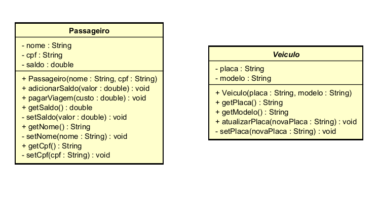 | 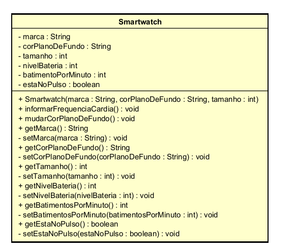 |

---

### Aula 5 - Associação

**Pergunta:** ""No construtor da `Viagem`, nós exigimos o objeto inteiro 
\(`Passageiro solicitante`\). Se o nosso resumo só precisa imprimir o nome da pessoa, 
não seria mais fácil e mais leve pedir apenas  a String do nome no construtor da Viagem 
\(`String nome DoPassageiro`\) em vez do objeto todo?"

_Pense nas regras de negócio: O que acontece na hora que a Viagem acaba e o sistema 
precisa descontar o  saldo? Se a Viagem tiver apenas a String "Ana Silva", ela consegue 
mexer no dinheiro dela?_"

**Sua Resposta:**

[O uso do objeto inteiro no construtor da Viagem é importante, pois ele permite acessar 
e modificar os dados reais do usuário, como por exemplo o saldo. Porém, caso fosse pedido apenas
a String do nome no construtor, a viagem só possuiria um valor de texto, sem qualquer ligação com
o cliente, ou seja, não seria possível acessar e descontar o valor da corrida no saldo do passageiro, 
já que não haveria acesso ao objeto original. Sem isso, a associação não permite que os objetos tenham
uma interação completa, não respeitando assim as regras de negócio e tornando o sistema menos funcional
e menos próximo da realidade.]

**Prints dos diagramas:**
| FiapRide | Smartwatch |
|----------|----------|
| 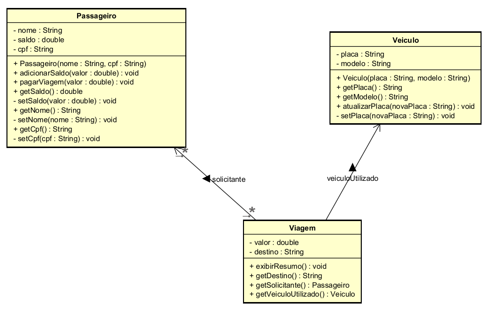 | 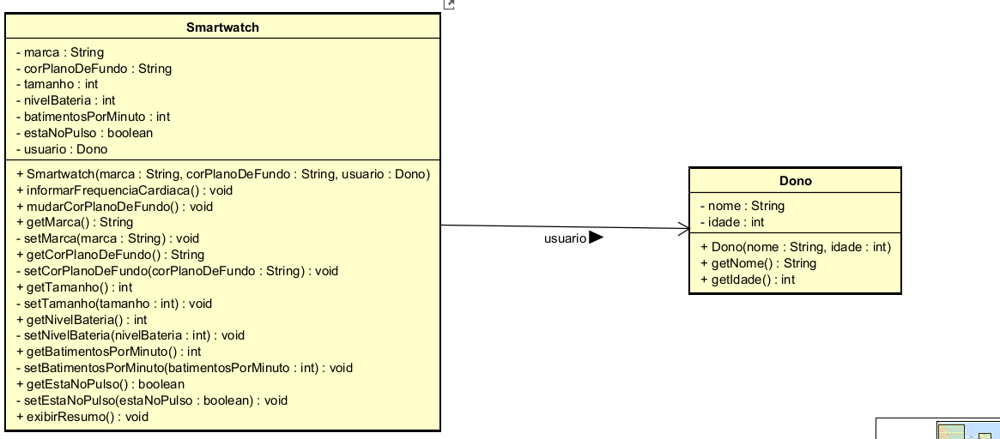 |

---

### Aula 6 - Herança

**Pergunta:** ""No nosso código, a mãe `Veiculo` possui os atributos `placa` e `modelo` 
como `private`. Quando o `Carro` herda de`Veiculo`, ele recebe esses atributos, mas o
código dentro de `Carro` NÃO consegue fazer `this.placa = "ABC"`. Ele é obrigado a usar
o `super\(\)` ou o `setPlaca\(\)`.

Por que o Java não deixa a filha alterar as variáveis privadas da mãe diretamente? Qual
o princípio das aulas passadas que isso está protegendo?""

**Sua Resposta:**

[O Java não deixa a classe filha alterar as variáveis privadas da mãe diretamente, porque esses 
atributos estão protegidos justamente para garantir a segurança e integridade dos dados, impedindo
assim que os valores deles sejam modificados. O princípio utilizado nas aulas passadas é o de encapsulamento,
com isso, mesmo com a herança a filha não pode acessar tudo livremente, sendo assim obrigada a usar super() ou
métodos controlados como setters, pois isso evita que os valores de atributos importantes sejam 
alterados sem nenhum  tipo de validação ou regra de negócio.]

**Prints dos diagramas:**
| FiapRide | Smartwatch |
|----------|----------|
| 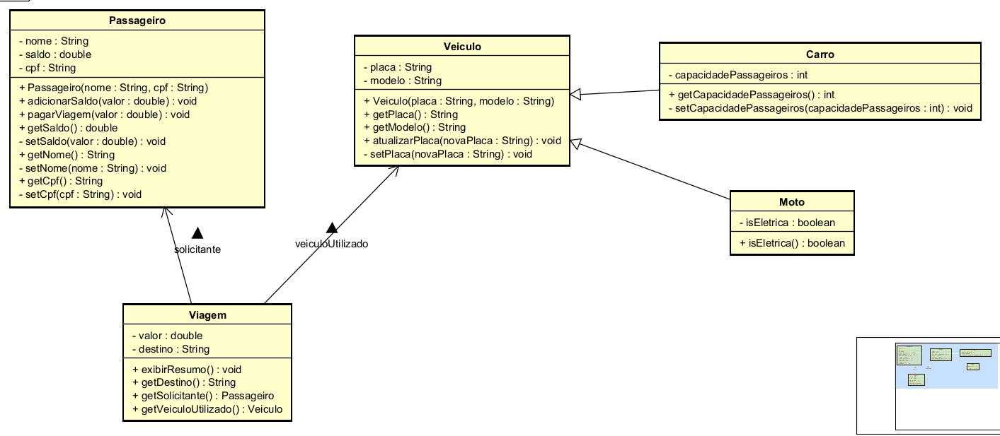 | 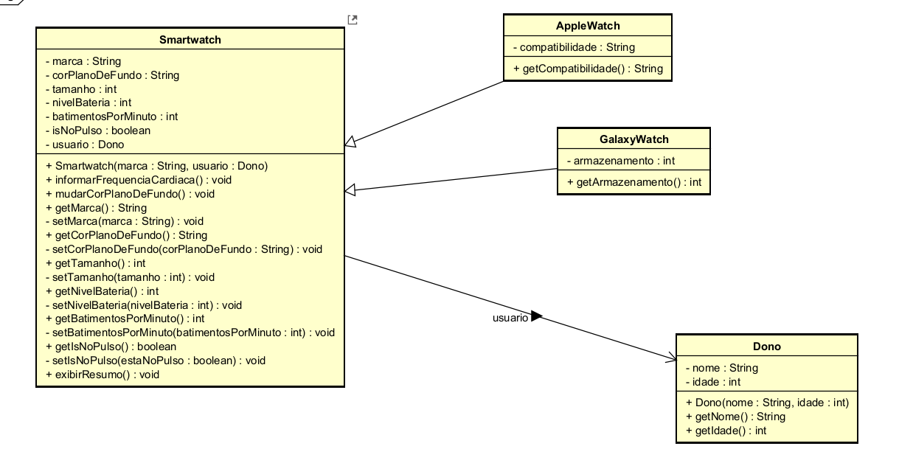 |

---

### Aula 7 - Polimorfismo

**Pergunta:** "No nosso loop `for \(Veiculo veiculo : frota\)`, a variável `veiculo` é do
tipo genérico `Veiculo`. Se esquecêssemos de criar o método `calcularAutonomia\(\)` lá na 
classe mãe `Veiculo`, nós conseguiríamos chamá-lo dentro do loop, mesmo sabendo que ele existe
dentro do `Carro` e da `Moto`? Por que o contrato precisa existir na base da hierarquia?"

**Sua Resposta:**

[Não, não conseguiríamos chamá-lo dentro do loop se ele não existisse na classe mãe, pois 
como `veiculo` é do tipo genérico, o Java só consegue reconhecer métodos que estão definidos 
nessa classe. Ou seja, mesmo que `Carro`e `Moto` possuam o método `calcularAutonomia\(\)`, ele
precisa existir dentro da classe mãe para poder ser chamado de forma  polimórfica. Dessa forma, 
ele funciona como um contrato, garantindo que todas as subclasses tenham que implementar esse 
comportamento, pois caso contrário o código não vai compilar, já que o Java não consegue garantir
que todos os objetos da lista terão esse método.]

**Prints dos diagramas:**
| FiapRide | Smartwatch |
|----------|----------|
| 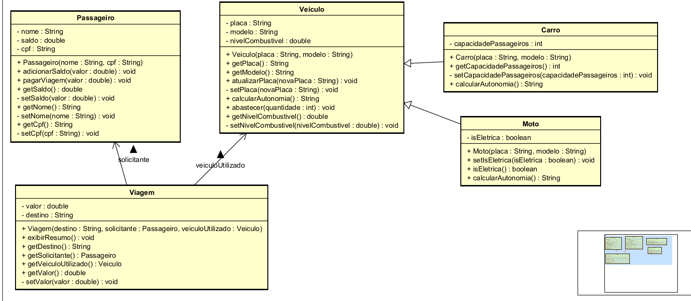 | 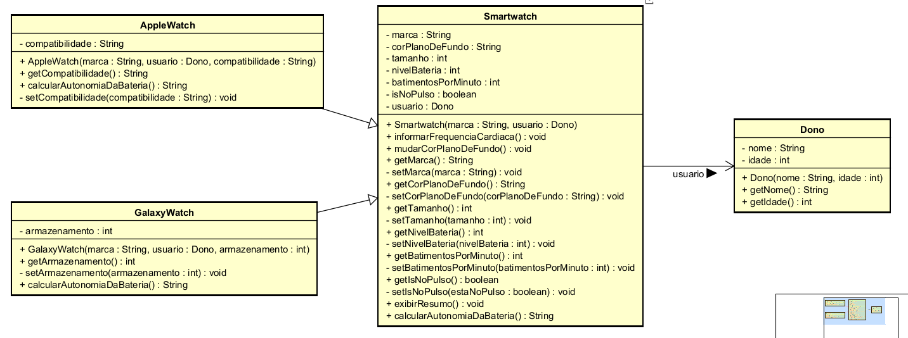 |

---

### Aula 8 - Classes Abstratas

**Pergunta:** "Pense no mundo real: Faz sentido existir um objeto que é APENAS 'Veículo' sem
ser um tipo específico? Você já entrou em uma concessionária e comprou "um veículo" genérico, 
sem ser carro, moto, caminhão ou nada disso?

Por que, então, no código, precisamos EXPLICITAMENTE dizer ao Java que `Veiculo` é `abstract`?
Por que ele não deduz isso sozinho?

Pense: Se esquecermos de colocar `abstract`, qual o risco que corremos? Alguém pode criar `new
Veiculo\(\)` e quebrar a lógica do nosso sistema?"

**Sua Resposta:**

[Não, não faz sentido existir um 'Veículo' sem ser de um tipo específico, como um carro ou uma
moto genérica. Por isso, no código é utilizado `abstract` para deixar explícito que a classe é apenas
um modelo base. Além disso, o java não consegue deduzir isso sozinho, pois ele não consegue entender 
o contexto do problema, apenas executa o que foi programado no código. Se esquecermos de usar `abstract`
alguma pessoa pode criar `new Veiculo\(\) e quebar a  lógica do sistema, já que não haveria nenhum 
impeditivo que proíbisse a criação de um veículo genérico. Dessa forma, a classe abstrata garante que
essa situação não aconteça.]

**Prints dos diagramas:**
| FiapRide | Smartwatch |
|----------|----------|
| 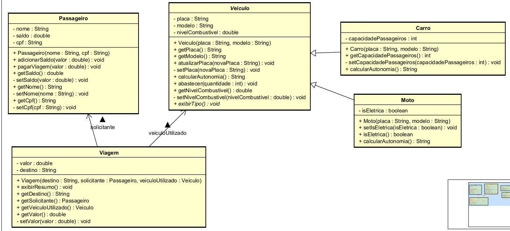 | 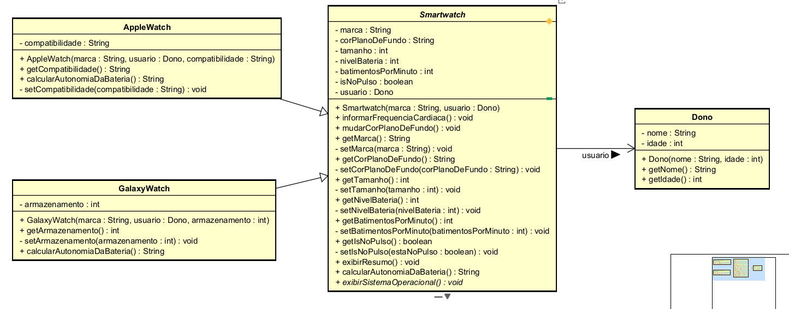 |

---

### Aula 9 - Interfaces

**Pergunta:** "Por que Java permite herança simples \(apenas uma mãe\), mas múltipla
implementação de interfaces \(vários contratos\)?

Pense: Se `CarroEletrico` pudesse herdar de `Veiculo` E de `Bateria` ao mesmo tempo 
\(herança múltipla\), o que aconteceria se AMBAS as mães tivessem um método chamado
`ligar\(\)`?

Como as interfaces resolvem esse problema? "

**Sua Resposta:**

[O Java permite apenas heranças simples, mas aceita múltiplas implementações de interfaces
para evitar conflitos entre classes, como em situações em que duas classes diferentes  possuem 
métodos com o mesmo nome. Nesse caso, o sistema não iria saber qual deles usar, o que causaria
ambiguidade. Para resolver isso, as interfaces apenas definem o que deve ser feito e não como. Assim,
mesmo que `CarroEletrico` e `Bateria` tenham um método chamado `ligar`, não haveria esse problema, 
pois a própria classe implementaria o comportamento, evitando assim a ambiguidade e os conflitos de
herança múltipla.]

**Prints dos diagramas:**
| FiapRide | Smartwatch |
|----------|----------|
| 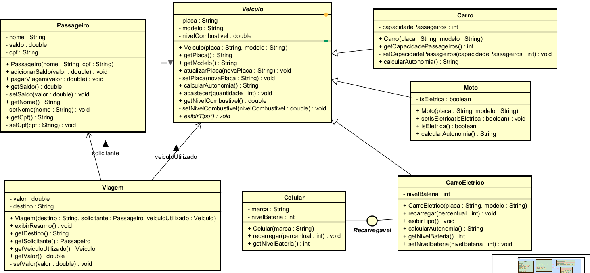 | 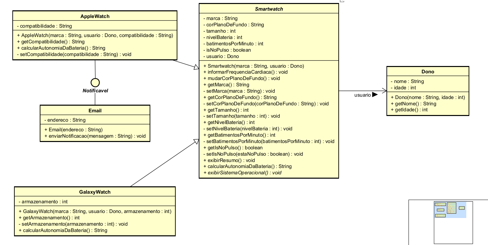 |

---

## Desafios Técnicos Implementados

### Desafio Pessoal (Seu Projeto)

**Qual foi o domínio que você escolheu para seu projeto pessoal?**

[O domínio que eu escolhi foi o de relógios de pulso inteligentes, mais especificamente 
um Smartwatch]

**Quais classes você criou?**

[Smartwatch, AppleWatch, GalaxyWatch e Dono]

**Qual foi o maior desafio técnico que você enfrentou?**

[O maior desafio técnico que eu enfrentei foi entender como aplicar corretamente
os conceitos de encapsulamento, métodos, clean code e polimorfismo. No início, eu
tinha  dificuldades em saber como implementar os  setters com as regras de negócio,
quais métodos seriam mais adequados para o meu objeto, como utlizar o polimorfismo
e o melhor jeito de deixar o código mais escalável. Além disso, tive alguns impasses
na hora de organizar as classes e resolver os desafios práticos. Com o passar das aulas
e das atividades, além dos exemplos presentes  nos materiais, eu fui conseguindo evoluir
e ter mais clareza na criação de métodos que eu poderia usar, bem como entendi melhor como
utilizar o polimorfismo para cada classe, como proteger  bem os dados com o uso das regras
de negócio e também do encapsulamento com getters e setters. Além de saber como resolver
os desafios, organizar e deixar o código mais limpo, baseado nas dicas de clean code presentes
em cada material das aulas. Com isso, no final eu pude perceber que o meu projeto pessoal 
evolui de forma significativa com o passar do tempo, já que a cada conteúdo novo visto na 
sala eu ia adicionando e melhorando o meu código, o que também me ajudou a consolidar melhor
o aprendizado na prática.]

---

## Conclusão

**O que você aprendeu nestas 9 aulas?**

[Nessas 9 aulas eu consegui aprender os principais conceitos de Programação 
Orientada a Objetos e como aplica-lás de forma prática em um projeto pessoal. 
Em que a cada aula eu fazia os desafios e inseria no meu objeto os conteúdos 
de classes e objetos, métodos, encapsulamento, construtores, associação, herança,
polimorfismo, classes abstratas e interfaces, além do uso do clean code, até o 
projeto ficar completo e bem estruturado.]

**Qual conceito foi mais difícil de entender?**

[O conceito mais difícil de entender foi o de polimorfismo
já que eu tive dificuldade de saber como implementar os 
métodos e comportamentos nas subclasses, para superá-lo eu
treinei com exemplos mais simples e estudei bastante os 
materiais das aulas.]

**O que você melhoraria no seu projeto se pudesse refazer?**

[Se eu pudesse refazer o meu projeto, eu melhoraria o clean code, deixando o código mais legível,
organizado e melhor estruturado, aprimoraria as regras de negócio e desenvolveria mais os métodos
das minhas classes, tornando-os mais completos.]
